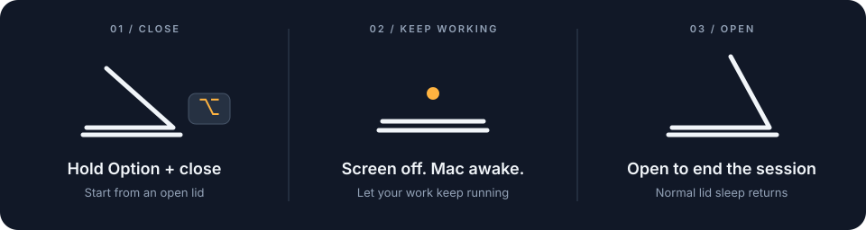

<p align="center">
  
</p>

<h1 align="center">Hinge</h1>

<p align="center">Keep your Mac awake with the lid closed.</p>
<p align="center">Apple Silicon MacBooks · macOS 14+</p>



## Use

- **For one lid close:** hold **⌥ Option** as you start closing the lid. Open it again to end the session.
- **Until you turn it off:** choose **Keep Awake** from the menu bar, then **Turn Off** when you're done.

Hinge pauses while an external display is connected and resumes when it's disconnected.

## Install from source

Requires full **Xcode** and **XcodeGen**.

```sh
git clone https://github.com/jadenpxrk/Hinge.git
cd Hinge
make install
open /Applications/Hinge.app
```

After updating, quit and reopen Hinge to use the new version.

## A few things to know

- Battery protection defaults to **10%**. Change it in Settings.
- Serious heat ends the awake session. **Keep your Mac ventilated—never running in a bag.**
- Hinge uses an undocumented macOS API, so compatibility may change with system updates.

[Technical details, commands & troubleshooting](docs/REFERENCE.md) · [MIT license](LICENSE)
